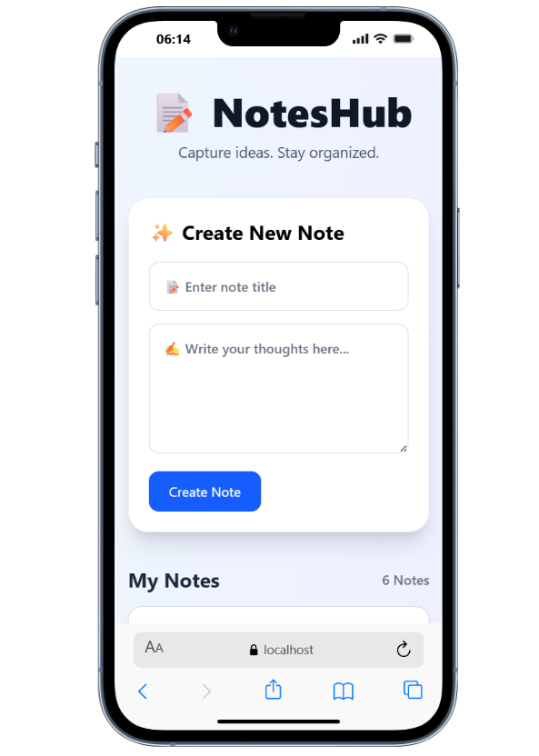
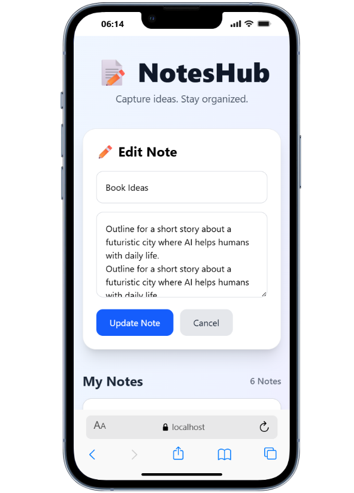
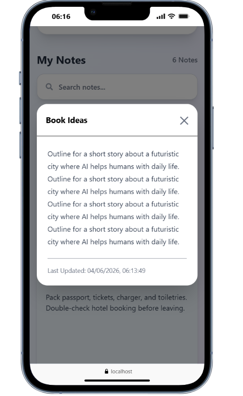
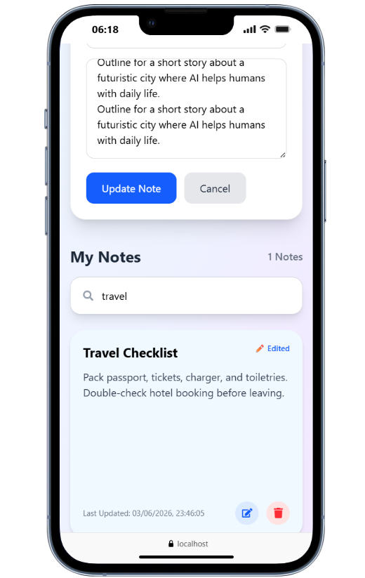

# Notes Management System

A full-stack Notes Management application built using React, Node.js, Express, and MongoDB.

## Features

- Create Notes
- Edit Notes
- Delete Notes
- Search Notes
- Responsive Design
- Toast Notifications
- Delete Confirmation Modal
- Read More Modal
- Created & Updated Timestamps
- Loading State
- Empty State Handling

## Tech Stack

### Frontend

- React.js
- Tailwind CSS
- Axios
- React Hot Toast
- SweetAlert2
- React Icons

### Backend

- Node.js
- Express.js
- MongoDB Atlas
- Mongoose

## Live Demo

Frontend:
https://notes-management-system-beta.vercel.app/

Backend API:
https://notes-management-system-rzyz.onrender.com/api/notes

## Installation

### Backend

```bash
cd backend
npm install
npm run dev
```

### Frontend

```bash
cd frontend
npm install
npm run dev
```

## Environment Variables

Created a `.env` file inside the backend folder:

```env
MONGO_URI=your_mongodb_connection_string
PORT=5000
```

## API Endpoints

### Get All Notes

```http
GET /api/notes
```

### Create Note

```http
POST /api/notes
```

### Update Note

```http
PUT /api/notes/:id
```

### Delete Note

```http
DELETE /api/notes/:id
```

### Search Notes

```http
GET /api/notes/search?q=keyword
```

## Screenshots

### Home Page



### Edit page



### Notes page


### Modal Large text Page



### Delete page


### Search View



## Author

Nagraj Vade
